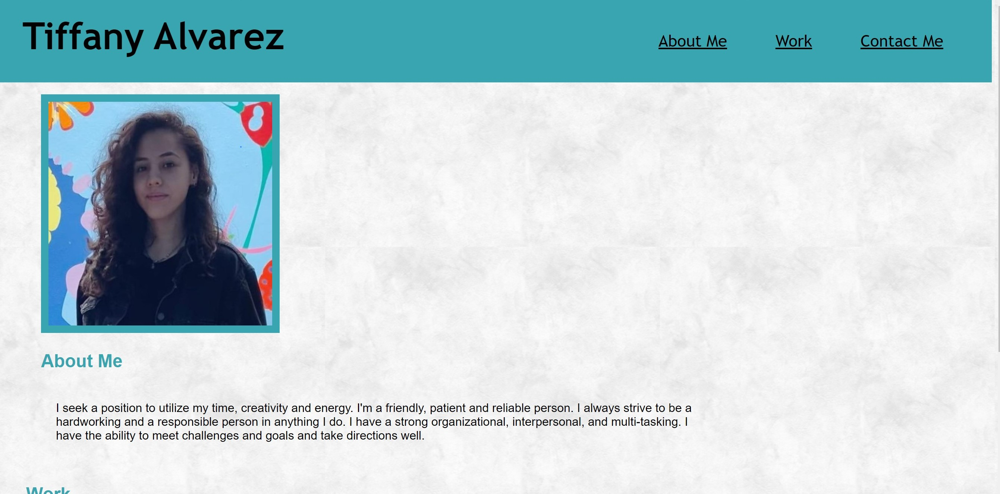

# My Portfolio

## I created my first "professional portfolio" from scratch.
## I build this project to help me practice when I apply jobs.
## This project will help me prepare for my first entry job as a Web Developer.
## I thought this project was challenging because I tried to make it look like the mock-up from BootCamp school but I did in my own pace.

Deployed Link: https://tiffyalva.github.io/Portfolio/